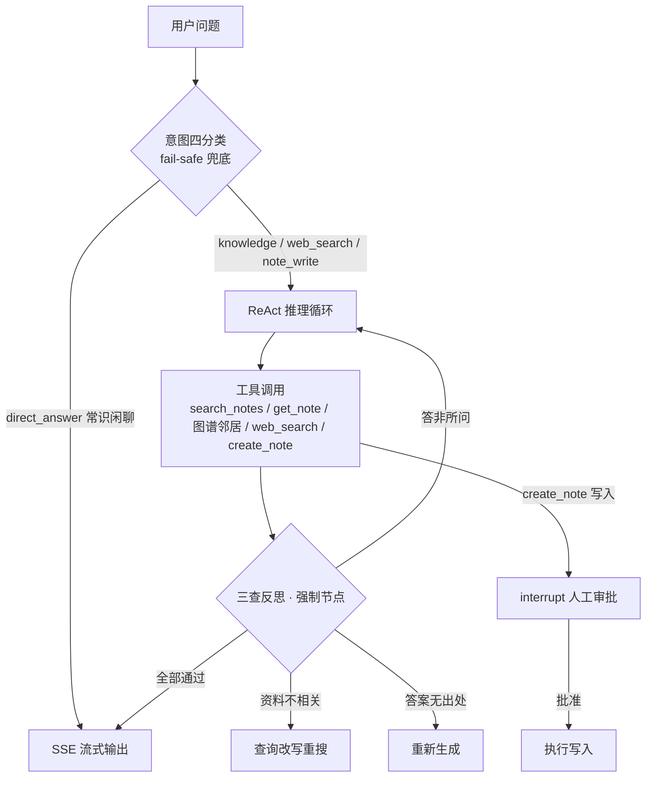

# 知枢星图 - 个人知识库系统

> 🚀 双向链接 + 知识图谱 + **Agentic RAG 智能问答**：从"搜一次就答"到"自主检索、三查自检、效果可量化"

[](https://opensource.org/licenses/MIT)
[](https://vuejs.org/)
[](https://fastapi.tiangolo.com/)
[](https://www.python.org/)
[](backend/tests/)

## ✨ 核心亮点：Agentic RAG

AI 问答不是简单的"检索一次喂给大模型"，而是一个 LangGraph 状态图驱动的完整 Agent：



- **🎯 意图四分类路由** - 入口 LLM 结构化输出分类（知识检索 / 短路直答 / 联网搜索 / 笔记写入），分类失败 fail-safe 默认兜底；直答短路降低 token 成本，平均工具调用 **2.0 → 1.0**
- **🪞 Self-RAG 三查反思** - 资料相关性 / 幻觉检测 / 答案质量实现为**图强制节点 + 条件边**（结构保证每轮必检，而非依赖模型自觉调用）
- **🛑 防失控三道闸** - 最大迭代 + token 预算双硬截断、同轮重复检索短路、不可用工具熔断；Agent 异常自动降级混合检索兜底链路
- **📊 量化评估体系** - 50 条六类离线评测集 + 新旧对比流水线；recall@k 纯计算 + Qwen 独立裁判（拆句逐条 grounded 判定）+ 10 条人工校准（裁判一致率 90% / 100%）
- **🔌 知识库 MCP 化** - FastMCP 3.x 挂载 FastAPI（`/mcp` 端点），API Key timing-safe 认证、未配置 fail-closed；与 Agent 共享同一工具层，Claude Desktop / Cursor 可直连检索（验证脚本 7/7 通过）
- **✍️ 写入人工审批（HITL）** - 笔记写入走 LangGraph interrupt，SSE 审批卡 + POST resume，中断状态可恢复（409 防串扰），工具调用全量审计
- **🧠 双层记忆** - 短期 checkpoint（会话内多轮）+ 长期 store（跨会话用户偏好），LangGraph 官方标准模型
- **👁️ 双源可观测** - Langfuse 云端优先 + 本地审计自动降级，前端实时展示 Thought / Action / Observation / Check 推理时间线

### 📈 评测结果（50 条六类离线评测集，报告可复现）

| 指标 | 基线 RAG | Agentic RAG | 说明 |
|------|:---:|:---:|------|
| recall@k | 0.993 | 0.983 | 纯计算 |
| faithfulness | 0.920 | 0.911 | 独立裁判 |
| answer_relevancy | 0.988 | 0.954 | 独立裁判 |
| simple_fact faithfulness | 0.950 | **1.000** | 意图路由修复"简单题掉链" |
| temporal faithfulness | 0.840 | **1.000** | 同上 |
| multi_hop faithfulness | 0.920 | **0.935** | 多跳反超基线 |

> 口径说明：基线 = 混合检索单轮直答；Agentic = 完整意图路由 + ReAct + 三查。Agent 整体与基线持平（评测噪声范围内），换来意图路由省 token、联网搜索扩展、写入人工审批、全链路可观测等基线不具备的能力；简单题 / 时间类 / 多跳类反超基线。评测驱动修复实录：两类 0 分 case（证据截断误判 / 答案退化 / 重复检索烧迭代）修复至 1.000，详见[升级笔记](docs/agentic-rag-upgrade/升级笔记.md)。

## ✨ 功能特性

### 🎯 知识管理
- **📝 笔记管理** - Markdown 编辑器，分屏预览，语法高亮
- **🔗 双向链接** - `[[笔记标题]]` 语法，建立知识关联
- **🕸️ 知识图谱** - 全局/局部图谱可视化（D3），图谱邻居可作为 Agent 检索工具
- **🔍 混合检索** - 向量语义检索 + 关键词检索融合

### 🤖 AI 能力
- **Agentic RAG 智能问答** - 见上方核心亮点，SSE 流式输出
- **联网搜索** - Tavily 集成，限速 + TTL 缓存 + 缺 Key 优雅降级（不阻塞主流程）
- **结构化输出** - function_calling 方式结构化判定，规避 response_format 兼容问题
- **Prompt / Skill 系统** - PromptLab + Skill 执行引擎 + Few-Shot 学习

### 🛡️ 安全
- **JWT 认证** + 环境变量管理敏感配置（API Key 不进代码 / 前端）
- **MCP fail-closed** - MCP_API_KEY 未配置时拒绝所有外部请求，宁可全拒不能裸奔
- **写入人工审批** - 有副作用的工具操作需人工批准
- **提示注入隔离** - 导入的网页 / PDF 内容以不可信数据边界包裹

## 🏗️ 技术栈

| 层 | 技术 |
|----|------|
| 前端 | Vue 3.4 · TypeScript · Pinia · Naive UI · Tailwind CSS · D3 |
| 后端 | Python 3.11 · FastAPI · SQLAlchemy · SSE |
| AI 编排 | LangGraph 0.2.x（状态图 / ReAct / 三查 / HITL / checkpoint）· LangChain |
| 模型 | DeepSeek-V4-flash（Agent 推理，显式关思考）· qwen3.7-text-embedding（向量化）· qwen3.7-max（独立评估裁判） |
| 数据 | FAISS（向量索引 + 混合检索）· SQLite · Redis |
| 生态 | FastMCP 3.x（MCP Server）· Tavily（联网搜索）· Langfuse（可观测）· pytest（后端 47 用例） |

## 🚀 快速开始

### 环境要求
- Python 3.11+（推荐用 uv 管理依赖，见 [启动文档](docs/启动文档.md)）
- Node.js 18+

### 1. 克隆与后端配置
```bash
git clone <your-repo-url>
cd 知枢星图/backend

python -m venv venv
venv\Scripts\activate        # Windows
pip install -r requirements.txt

cp .env.example .env         # 编辑 .env 填入你的 API Key
```

`.env` 关键配置（完整项见 `.env.example`）：
```env
# Agent 推理（DeepSeek 官方通道，thinking 显式关闭）
DEEPSEEK_API_KEY=your-deepseek-api-key
DEEPSEEK_MODEL=deepseek-v4-flash
DEEPSEEK_THINKING=disabled

# 向量化 + 评估裁判（阿里云 DashScope）
DASHSCOPE_API_KEY=your-dashscope-api-key
QWEN_EMBEDDING_MODEL=qwen3.7-text-embedding
QWEN_JUDGE_MODEL=qwen3.7-max-2026-06-08

# 联网搜索（Tavily 免费注册 https://tavily.com；为空则工具优雅降级）
TAVILY_API_KEY=tvly-xxx

# MCP Server 认证（为空则拒绝所有 MCP 请求）
MCP_API_KEY=your-mcp-api-key

# 可观测（可选，fail-silent）
LANGFUSE_PUBLIC_KEY=
LANGFUSE_SECRET_KEY=
```

### 2. 启动
```bash
# 后端
python -m uvicorn app.main:app --reload --port 8000

# 前端（另开终端）
cd ../frontend
npm install
npm run dev
```

打开 `http://localhost:5173`，在「AI 助手」发起问答即可看到完整的推理时间线。

### 3. 验证脚本（推荐先跑）
```bash
python scripts/verify_deepseek_tools.py   # 模型工具调用契约 4/4
python scripts/verify_mcp_server.py       # MCP Server 全链路 7/7
python scripts/verify_web_search.py       # 联网搜索（含降级模式）
python eval/run_eval.py                   # 50 条评测集新旧对比
```

## 🔌 API 接口

```
# 认证 / 笔记 / 文件夹 / 标签
POST /api/auth/login            GET/POST/PUT/DELETE /api/notes
GET  /api/notes/:id/backlinks   # 反向链接

# 检索
GET  /api/search                # 全文搜索
POST /api/search/hybrid         # 混合检索
POST /api/search/ai             # RAG 问答（基线链路）

# Agentic RAG
POST /api/agent/chat/stream     # Agent 问答（SSE 流式：thought/action/observation/check/final_answer）
GET  /api/agent/sessions        # 会话管理
POST /api/agent/resume          # HITL 审批恢复
GET  /api/agent/traces          # 可观测 trace
GET  /api/agent/observability/summary

# 知识图谱
GET  /api/graph/global          GET /api/graph/local/:id

# MCP Server（API Key 认证，Claude Desktop / Cursor 直连）
POST /mcp
```

## 📚 文档

- [Agentic RAG 升级笔记](docs/agentic-rag-upgrade/升级笔记.md) — 12 项架构决策 + 21 个踩坑 + M0-M6 全过程
- [Agentic RAG 待做清单](docs/agentic-rag-upgrade/待做清单.md) — 收尾遗留与新发现缺陷
- [MCP 集成指南](docs/MCP_INTEGRATION.md) — Claude Desktop / Cursor 接入配置
- [启动文档](docs/启动文档.md) — Windows / Anaconda 环境启动与故障排查
- [CODE WIKI](docs/CODE_WIKI.md) — 代码架构全览

## 🗺️ 版本演进

```
V1 MVP          V2 分类升级       V3 Skill         V4 扩展           V5 Agentic RAG (2026.08)
  │                │                │                │                 │
  ▼                ▼                ▼                ▼                 ▼
┌─────────┐    ┌─────────┐    ┌─────────┐    ┌─────────┐    ┌──────────────────┐
│ 笔记管理 │    │ 分类体系 │    │ Skill   │    │ 语义搜索 │    │ M0 embedding 迁移│
│ 文件夹   │ -> │ 内容类型 │ -> │ 执行引擎│ -> │ 导入导出 │ -> │ M1 ReAct + 三查  │
│ 标签     │    │ 素材管理 │    │ AI生成  │    │ 浏览器插件│   │ M2 评估 + 可观测 │
│ 双向链接 │    │ 模板系统 │    │ 自动化  │    │ 批量处理 │    │ M3 MCP + 联网    │
│ 知识图谱 │    │          │    │         │    │          │    │ M4 记忆 + HITL   │
│ AI问答   │    │          │    │         │    │          │    │ M5 监控面板      │
│          │    │          │    │         │    │          │    │ M6 意图路由      │
└─────────┘    └─────────┘    └─────────┘    └─────────┘    └──────────────────┘
```

## 📄 License

MIT License - 详见 [LICENSE](LICENSE) 文件
